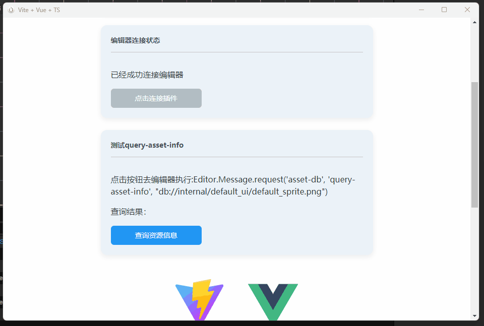

🎮 Cocos Creator 跨引擎插件模板（支持 v3.x & v2.x）

## 🌟 项目定位

本项目是一套跨引擎版本的 Cocos Creator 插件开发模板，同时兼容 Cocos Creator 3.x 和 2.x 版本。基于「Electron + Vue3/Vite」技术栈打造，助你高效开发高性能插件，告别传统原生 UI 开发的繁琐！

## 💡 核心理念 | 真传一句话

**Cocos Creator 基于 Electron 内核，支持通过 Electron 弹窗加载网页。因此，我们只需专注开发 Vue 网页项目，为其补充 Node.js 能力与编辑器功能支持，即可快速实现完整插件功能！**

## ✨ 选择本插件模板的理由

• 极致开发体验：纯 Vue + Vite 开发，享受现代前端工程化红利（HMR 热重载、ES6+ 语法、TypeScript 支持）。  

• 丰富的 UI 生态：直接调用 Vue 生态海量 UI 组件库（Element Plus、Naive UI 等），告别原生 UI 组件的局限性。  

• 高效迭代：代码修改秒级生效（热重载），开发效率提升 10086%！  

• **一套代码，通用cocos v3.x和cocos v2.x**


唯一限制是无法直接使用 Cocos 编辑器原生 UI 组件

## 开源
模板代码已开源，欢迎star： [Github](https://github.com/hyz1992/cocos-plugin-template-best.git )

您也可以选择在此购买插件，请作者吃碗猪脚饭： [Cocos Store](https://store.cocos.com/app/detail/8016 )

##  🖼️ 功能演示

* 热重载示例


*  编辑器接口能力示例


其中，调用编辑器接口实例如下，本质是再插件上下文中eval相关代码指令：
```typescript
export async function queryAssetInfoByUrl(url:string){
    let cmdStr = ""
    if(await isV2()){
        const url = "db://internal/image/default_sprite.png"
        cmdStr = `return Editor.assetdb.assetInfo('${url}');`
    }else if(await isV3()){
        const url = "db://internal/default_ui/default_sprite.png"
        cmdStr = `return await Editor.Message.request('asset-db', 'query-asset-info', "${url}")`
    }else{
        return null
    }

    const ret = await _editotBridge.reqEval(cmdStr,true)
    return ret
}
```

## 🛠️ 双版本目录结构（v3.x & v2.x）

两版本核心逻辑高度一致，均采用 Electron + WebSocket + Preload + Vite-Vue 技术栈，插件源码集中于 vite-vue-proj 目录。

🌐 v3.x 目录结构

```bash
cocos-v3-plugin-template-best/
├── @types/                  # TypeScript 类型声明
├── i18n/                    # 多语言资源（国际化支持）
├── src/                     # Electron 主进程核心代码
│   ├── editor_ws_server.ts  # WebSocket 服务（连接 Vue 网页与 Cocos 编辑器）
│   ├── electron_win.ts      # Electron 窗口管理（创建/控制弹窗）
│   ├── main.ts              # 主进程入口（初始化 Electron 窗口）
│   └── preload.js           # 预加载脚本（桥接 Node.js 能力与 Vue 网页）
├── node_modules/            # 项目依赖
├── vite-vue-proj/           # 插件核心源码（Vue3 + Vite 开发目录）
├── web/                     # 构建输出目录（发布后 Electron 加载此目录的静态网页）
├── package.json             # 依赖管理与脚本配置（重点关注编辑器菜单入口）
├── tsconfig.json            # TypeScript 配置
```


🌐 v2.x 目录结构

```bash
cocos-v2-plugin-template-best/
├── editor_ws_server.js      # WebSocket 服务（v2 版本实现）
├── electron_win.js          # Electron 窗口管理（v2 版本实现）
├── main.js                  # 主进程入口（v2 版本实现）
├── preload.js               # 预加载脚本（v2 版本实现）
├── node_modules/            # 项目依赖
├── vite-vue-proj/           # 插件核心源码（Vue3 + Vite 开发目录）
├── web/                     # 构建输出目录（发布后 Electron 加载此目录的静态网页）
└── package.json             # 依赖管理与脚本配置（v2 版本）
```

## 🚀 快速上手指南

1. 环境准备

确保已安装：  
• Node.js

• Cocos Creator（v3.x 或 v2.x，根据目标版本选择）  

2. 安装依赖

下载模板后，进入 vite-vue-proj 目录（插件核心源码目录）：  
cd vite-vue-proj
npm install  # 安装 Vue 项目依赖


3. 开发模式（热重载）

启动 Vue 项目开发服务器，享受实时预览：  
npm run dev  # 启动 HMR 热重载


4. 发布准备

构建生产环境代码（生成压缩后的静态网页）：  
npm run build  # 输出至 ../web 目录（发布时需打包此目录）


5. 关键配置（必看！）

发布前需修改 Electron 窗口加载代码，切换「开发模式」与「发布模式」的加载方式：  
在 electron_win.ts（v3）或 electron_win.js（v2）中：  
```js
// 开发模式：加载 Vue 本地服务（热重载）
if (false) {
  _win.loadURL('http://localhost:5173/');
} 
// 发布模式：加载本地构建的静态网页（打包后）
else {
  const filePath = path.join(pluginPath, "web/index.html");
  _win.loadFile(filePath);  // 关键修改！
}
```


## 📜 其他强烈推荐
* [【cc-debuger】CocosCreator 调试利器 ](https://store.cocos.com/app/detail/7417)

* [【极简无侵入】新手引导插件](https://store.cocos.com/app/detail/6679)

* [【shader学习】论坛最初版：倒水小游戏](https://store.cocos.com/app/detail/5664)


--- 

🌈 用更高效的方式，开发更强大的 Cocos 插件！